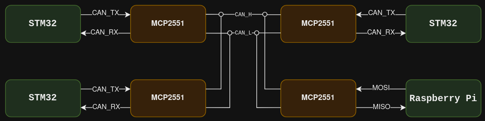

# CAN module for STM32

## Table of Contents
- [How does it work?](#how-does-it-work)
- [Implementation](#implementation)
- [STM32 configuration](#stm32-configuration)
- [Code Example](#code-example)
- [To-Do List for Enhancement](#to-do-list-for-enhancement)

## How does it work?
The CAN module is a multi-master, multi-slave protocol that allows multiple devices to communicate with each other. It is a message-based protocol that uses a message frame to transmit data. The message frame consists of an 11-bit identifier, a data field, and a CRC field. The CAN protocol uses a differential signal to transmit data, which makes it immune to noise and interference.

In order to use the CAN module on the STM32 microcontroller, you need to configure the CAN peripheral to work with a CAN transceiver, such as the `MCP2551`. The transceiver converts the differential signal from the CAN peripheral to a single-ended signal that can be read by the microcontroller and vice-versa.

The following diagram shows the setup of the CAN module on the STM32 microcontroller and a Raspberry Pi with the MCP2551 transceiver. Note that this is note the complete electrical setup, as it does not show ***the end termination resistors*** and the power supply connections.



This guide cannot cover all the details of the CAN protocol because it is a complex protocol. Hence, it is recommended to refer to additional resources to understand the CAN protocol in more detail.

## Implementation

### Message Frame of 2023/2024 project
```markdown
# Attention :
This library is designed to work with the message frame of the 2023/2024 project. If you are working on a different frame, you will need to modify the code accordingly, especially the sending and receiving functions.
```

<table>
  <tr>
    <td colspan="11" align="center">Header (11bits)</td>
    <td colspan="8" align="center">Data (8 bytes)</td>
  </tr>
  <tr align="center">
    <td>1</td>
    <td>2</td>
    <td>3</td>
    <td>4</td>
    <td>5</td>
    <td>6</td>
    <td>7</td>
    <td>8</td>
    <td>9</td>
    <td>10</td>
    <td>11</td>
    <td>1</td>
    <td>2</td>
    <td>3</td>
    <td>4</td>
    <td>5</td>
    <td>6</td>
    <td>7</td>
    <td>8</td>
  </tr>
  <tr align="center">
    <td colspan="3">Priority <br/> (3bits)</td>
    <td colspan="4">ID receiver <br/> (4bits)</td>
    <td colspan="4">ID transmitter <br/>  (4bits)</td>
    <td>ID Command <br/>  (1 Byte)</td>
    <td>1st parameter<br/>  (1 Byte)</td>
    <td colspan="6">Optional parameters <br/>  (6 Bytes)</td>
  </tr>
</table>

### Send and receive

**The ID of the master** noted `CAN_ID_MASTER` in the code header file is used in the 2023-2024 implementation to identify the Raspberry Pi.

**The ID of the current device** can be set by the `CAN_initInterface` function.

A device can received messages containing its ID from any other device and ignore others messages (thanks to the filter configuration).

A device can send messages to any other device by setting the ID of the receiver in the message.

## STM32 configuration
To configure the CAN peripheral to work with the MCP2551 transceiver and with a bit rate of `125kbps`, the following configurations are required:

- **Clock Divider** : Divide kernel clock by 2
- **Frame Format** : Classic mode
- **Mode** : Normal mode
- **Auto Retransmission** : Disable
- **Transmit Pause** : Disable
- **Protocol Exception** : Disable
- **Nominal Sync Jump Width** : 1
- **Data Prescaler** : 1
- **Data Sync Jump Width** : 1
- **Data Time Seg1** : 1
- **Data Time Seg2** : 1
- **Std Filters Nbr** : 1
- **Ext Filters Nbr** : 0
- **Tx Fifo Queue Mode** : FIFO mode
- **Nominal Prescaler** : 8
- **Nominal Time Seg1** : 3
- **Nominal Time Seg2** : 4

## Code Example
```c
/* Includes ------------------------------------------------------------------*/
#include "main.h"

/* Private includes ----------------------------------------------------------*/
/* USER CODE BEGIN Includes */
#include "can_stm32/can_stm32.h"
/* USER CODE END Includes */

/* Private variables ---------------------------------------------------------*/
FDCAN_HandleTypeDef hfdcan1;

/* Private function prototypes -----------------------------------------------*/
void SystemClock_Config(void);
static void MX_GPIO_Init(void);
static void MX_FDCAN1_Init(void);

/* Private user code ---------------------------------------------------------*/
/* USER CODE BEGIN 0 */
void decodeCanMsg(void){
	/* Code */
}
/* USER CODE END 0 */

/**
  * @brief  The application entry point.
  * @retval int
  */
int main(void)
{

  /* USER CODE BEGIN 1 */

  /* USER CODE END 1 */

  /* MCU Configuration--------------------------------------------------------*/

  /* Reset of all peripherals, Initializes the Flash interface and the Systick. */
  HAL_Init();

  /* USER CODE BEGIN Init */
  const uint8_t CAN_STM_ID = 2;
  CAN_initInterface(&hfdcan1, CAN_STM_ID);
  CAN_filterConfig();
  CAN_setReceiveCallback(decodeCanMsg);
  CAN_start();
  /* USER CODE END Init */

  /* Configure the system clock */
  SystemClock_Config();

  /* USER CODE BEGIN SysInit */

  /* USER CODE END SysInit */

  /* Initialize all configured peripherals */
  MX_GPIO_Init();
  MX_FDCAN1_Init();
  /* USER CODE BEGIN 2 */
  uint8_t dataToSend[8] = {2,4,6,8,10,12,14,16};
  /* USER CODE END 2 */

  /* Infinite loop */
  /* USER CODE BEGIN WHILE */
  while (1)
  {
    /* USER CODE END WHILE */

    /* USER CODE BEGIN 3 */
	  CAN_send(dataToSend, 0, CAN_ID_MASTER);
	  HAL_Delay(10);
	  CAN_read();
	  HAL_Delay(10);
	  CAN_sendBackPing(CAN_ID_MASTER);	
	  HAL_Delay(10);
  }
  /* USER CODE END 3 */
}
```

## To-Do List for Enhancement
- [ ] Implement interrupt-based receive function