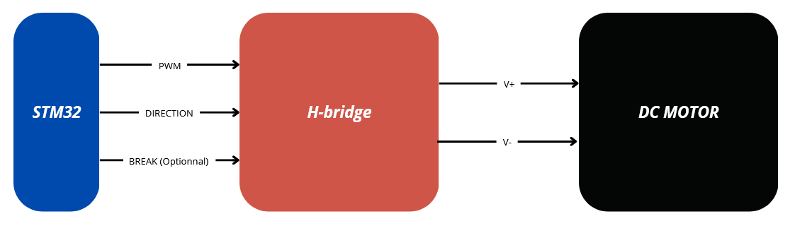

# DC Motor

## Table of Contents
- [How does it work?](#how-does-it-work)
- [Connections](#connections)
- [STM32 configuration](#stm32-configuration)
- [Code Example](#code-example)
- [To-Do List for Enhancement](#to-do-list-for-enhancement)

Feel free to contribute to this documentation by submitting pull requests or opening issues on our GitHub repository.

## How does it work?
- DC Motors
- H-bridge
- STM32 (timers, PWM, GPIO)
- CubeIDE

## Connections

To connect the DC motor to your microcontroller, you will need a H-bridge for interface. The circuit a as follow:



## STM32 configuration

### Timer Configuration
- Clock Source: Internal Clock
- Channel 1 (for example) : PWM Generation CH1
- Prescaler: 7
- Counter Period: 99

**Frequency of Timer for dc motor = 20kHz**

### GPIO Configuration
A GPIO pin is automatically configured when setting up the Timer for PWM. You can rename it.

For other output pins, you should configure them as follows:
- Mode: GPIO_Output
- Name: as you wish

## Code Example

```C
// Definition generated by CubeIDE configuration tool
TIM_HandleTypeDef htim2;

// User-defined variables
Motor_Config motor;
uint32_t motor_tim_channel = TIM_CHANNEL_1;

int main(void){
  /* USER CODE BEGIN 1 */
  uint8_t duty_cycle = 0;
  /* USER CODE END 1 */

  /*
    .... Initialization by CubeIDE
  */

  /* USER CODE BEGIN 2 */
  // Initialize the motor
  Motor_Init(&motor, motor_dir_GPIO_Port, motor_dir_Pin, &htim2, motor_tim_channel);
  // motor_dir_GPIO_Port and motor_dir_Pin are the name configured in CubeIDE configuration tool

  // Start the motor
  Motor_Start(&motor);

  // Set the speed and direction of the motor at 30% duty cycle and Clock-Wise direction
  Motor_Set_Speed(&motor, 30);
  Motor_Set_Direction(&motor, MOTOR_DIRECTION_CW);
  /* USER CODE END 2 */

  /* USER CODE BEGIN WHILE */
  while (1)
  {
    /* USER CODE END WHILE */

    /* USER CODE BEGIN 3 */
	  HAL_Delay(500);
	  duty_cycle = Motor_Get_Duty_Cycle(&motor);
	  //Motor_Toggle_Direction(&motor);
  }
}

```

## To-Do List for Enhancement
- Add BREAK pin for the motor