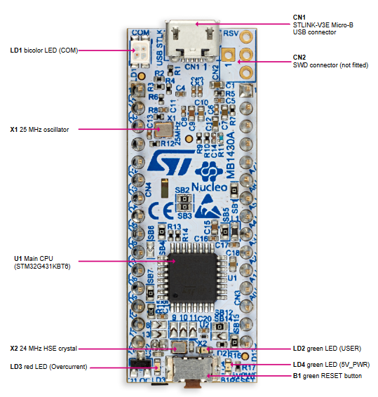

# LED controller
A simple LED controller using GPIO, used to learn how to work with STM32CubeIDE and STM32.

## How does it work?
- GPIO
- LED

## Connections
PINOUT -> LED -> RESISTOR_PULLDOWN_1K -> GND
(circuit diagram to be added)

## STM32 configuration
### GPIO Configuration
You need to configure a Pin for your LED as follows:
- Mode: GPIO_Output
- Name: as you wish

If you want to control the onboarding LED (LD2 User LED - see picture below), configure the PB8 pin (cf. STM32G4 User manual page 16)



## Code Example
```C
LED_TypeDef MyLED;

int main(void){
    /* USER CODE BEGIN 1 */
    /* USER CODE END 1 */
    
    /*
        .... Initialization by CubeIDE
    */
    
    /* USER CODE BEGIN 2 */
    // Initialize the LED
    LED_Init(&MyLED, GPIOB, GPIO_PIN_8); // For LD2 User LED
    
    /* USER CODE END 2 */
    
    /* Infinite loop */
    /* USER CODE BEGIN WHILE */
    while (1)
    {
        /* USER CODE END WHILE */
    
        /* USER CODE BEGIN 3 */
        // Turn on the LED
        LED_Turn_On(&MyLED);

        HAL_Delay(1000); // Delay for 1 second
        // Turn off the LED
        LED_Turn_Off(&MyLED);
    }
    /* USER CODE END 3 */
    }
    ```
