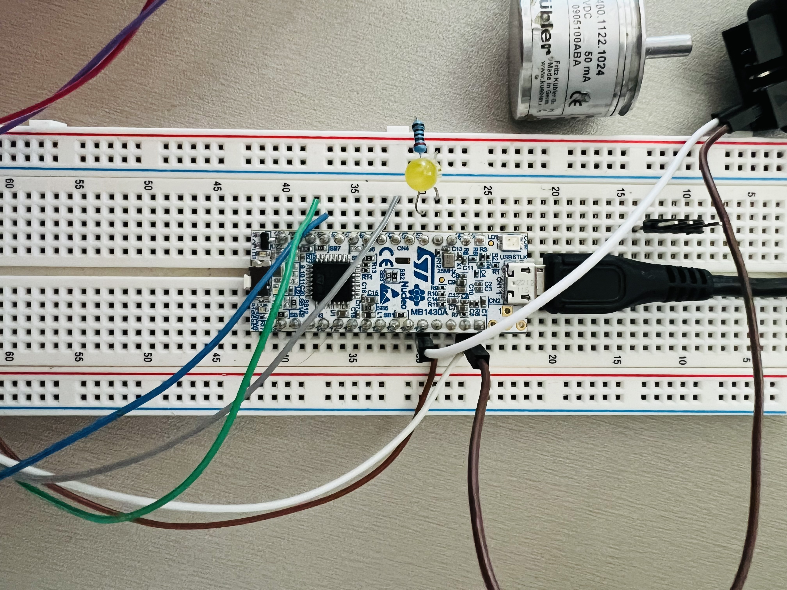

# Library for Embedded Code on STM32 Board

This repository contains embedded code for different components on the STM32 board. It serves as a library for Club Robot INSA Toulouse to work on STM32-based projects.

Contributions are welcome! If you have any improvements or bug fixes, feel free to submit a pull request.

## Table of Contents

- [Components supported list](#components-supported-list)
- [How to work on this project](#how-to-work-on-this-project)
- [How to use this library](#how-to-use-this-library)
- [Components](#components)
    - [DC Motor](#dc-motor)
    - [Encoder](#encoder)
    - [Servo](#servo)
    - [Herkulex servo](#herkulex-servo)
    - [CAN bus](#can-bus)
    - [UART](#uart)
    - [...]
- [Contributors](#contributors)

## Components supported list

- DC motor
- Encoder
- Servo
- Herkulex Servo
- CAN bus
- [...]

## How to contribute to this project

Clone the project to your local machine with the following command :
`git clone [link]`

Create a new branch with the following command :
`git checkout -b [branch_name]`

Make your changes and commit them with the following commands :
`git add .`
`git commit -m "Your message"`

Push your changes to the remote repository with the following command :
`git push origin [branch_name]`

When the development is finished, create a pull request on GitHub.

## How to use this library
**0. Create your STM32 project**

First you need to create a STM32CubeIDE project. If you already have one, skip this step. 

**Follow this guide to [Create a STM32 project](link to the guide).**

Next we will add this library as a submodule for your project.


**1. Add submodule**

From your project, add this library as a submodule with the following command :

`git submodule add https://github.com/ClubRobotInsat/stmlib.git`

**2. Initialize and update submodule**

Initialize and update your submodules to fetch the code :

`git submodule init`

`git submodule update`

**3. Update submodule to get the latest version from GitHub**

In the submodule repo :
`git pull`


**4. Add the library to your project**

To add the library to your project : 
-  Open your project in STM32CubeIDE
- Right-click on the project name, and select `New` -> `Folder`
- Click on `Advanced` and select `Link to alternate location (Linked Folder)`
- If the `stmlib` folder is in the root directory of your project, type `PROJECT_LOC/stmlib` in the `Location` field. If it is in another directory, type the path to the `stmlib` folder.
- Click on `Finish`

Now to include the library in the C include path :
- Click on the `Project` -> `Properties` (upper bar)
- In the `C/C++ General` section, click on `Paths and Symbols`
- In the `Includes` tab, click on `Add` and select `Workspace` then select the `stmlib` folder
- In the `Source Location` field, click on `Add folder` and select the `stmlib` folder
- Click on `Apply and Close`

```markdown
# Attention :
If your haven't configured the STM32 board hardware proprely, you may not be able to compile the project.

Some elements in the library require the STM32 board hardware to be configured properly.

For example : dcmotor.h requires a timer to be configured so that stm32g4xx_hal_tim.h is included in the project.
```

That's it! You can now include the library in your code. Check the [components](#components) section for more exemples.

## Components

### DC motor

View the [DC motor documentation](dcmotor/dcmotor_doc.md) for more information.

### Encoder

Description of component 2 and how to use it.

### Servo

Description of component 3 and how to use it.

### Herkulex servo

Description of component 3 and how to use it.

### CAN bus

Description of component 3 and how to use it.

### UART

Description of component 3 and how to use it.

## Contributors
- Triet NGUYEN (trietngh)
- Huong Cam TANG (tanghuongcam)
- Liam CHRISMENT (LiamKaist)